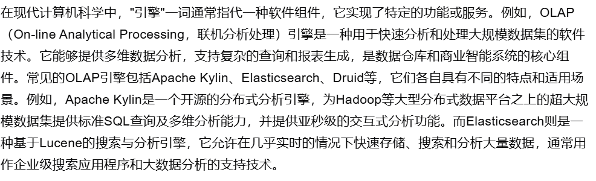

# 第一集 计算机早期历史-Early Computing 
## 主要内容
*计算机早期的历史和发展以及“计算机”一词的演变*  
## 涉及技术
  - __计算设备的变迁__   
     从算盘到星盘,计算尺等
  -  __"计算机"一词的流变__  
    从指代进行计算的人到后来指代计算设备  
     体现了计算的精细化复杂化趋势
  -  **涉及的技术**
      -  差分引擎和分析引擎[^1]  
          [^1]:查尔斯·巴贝奇设计的两种机械计算机
      -  制表机[^2]  
          [^2]:由赫尔曼·霍勒瑞斯发明,使用穿孔卡进行数据输入，极大地提高了人口普查的效率
## 思考
   为什么差分引擎和分析引擎被称为引擎?
          
           通过查阅资料,它们具有运行逻辑程序的能力,和现代的计算机引擎逻辑类似,可以称之为引擎
    
