<!-- vscode-markdown-toc -->
* 1. [安装和配置](#)
* 2. [创建仓库](#-1)
* 3. [在本地的笔记文件夹里初始化一个git仓库](#git)
* 4. [进行版本控制](#-1)
* 5. [将该本地仓库关联到GitHub的自己账号下的远程仓库](#GitHub)
* 6. [我想说的](#-1)
* 7. [git基本操作](#git-1)
* 8. [完成任务要求](#-1)

<!-- vscode-markdown-toc-config
	numbering=true
	autoSave=true
	/vscode-markdown-toc-config -->
<!-- /vscode-markdown-toc --># Git的使用
***我将记录我学习Git使用的流程.***
##  1. 安装和配置
1. 从https://gitforwindows.org/下载安装包并安装  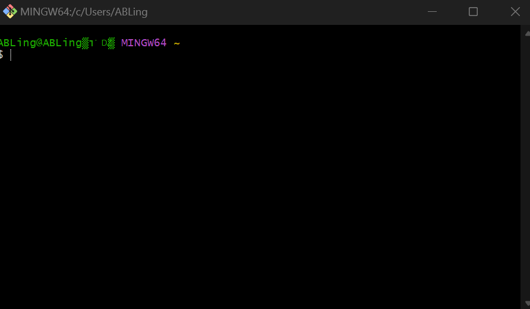
2. 使用`git config`指令配置环境变量
   - 设置姓名和邮箱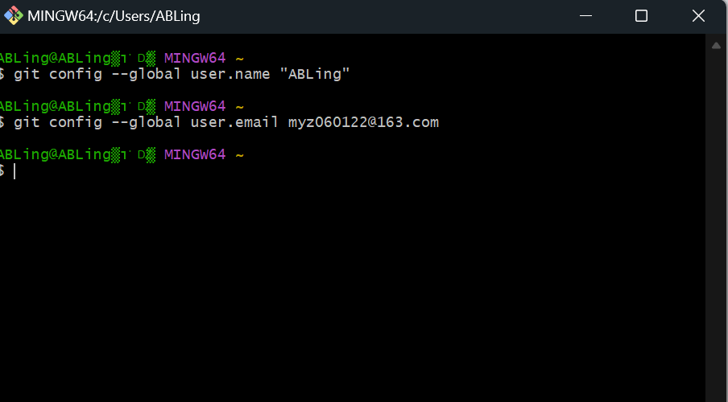
   - 发现笔记本名称存在乱码,检查字符编码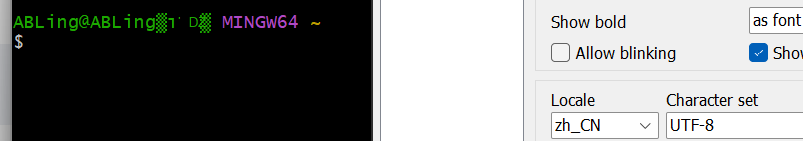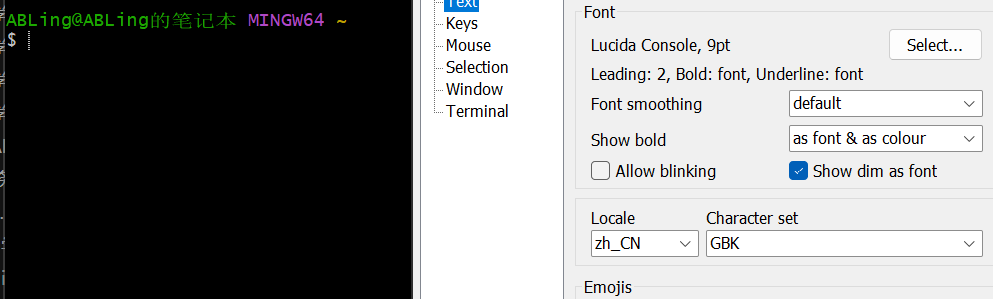,使用GBK编码实现了中文显示
##  2. 创建仓库
1. git实际上会默认以C:\Users\ *名称*为工作区
2. 在C:\Users\ *名称*创建了my-project文件夹作为目录
3. 使用指定目录作为Git仓库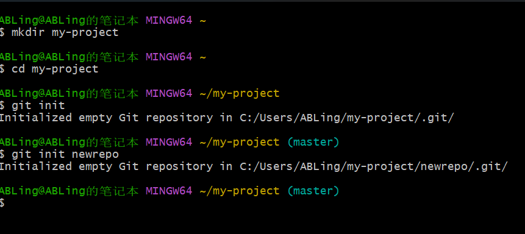
##  3. 在本地的笔记文件夹里初始化一个git仓库
1. 使用`rm -rf .git`取消旧仓库
2. 在 D:\Git_Repository中创造新仓库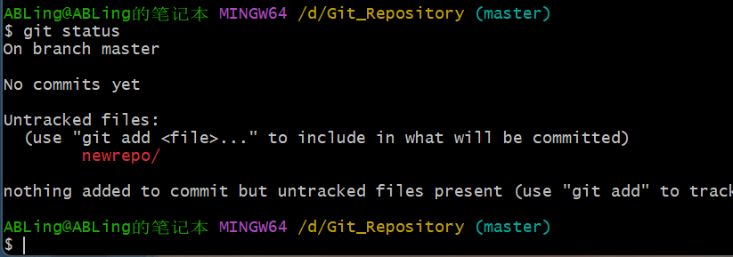
##  4. 进行版本控制
1. 输入`git add .`将我的笔记存入暂存区
2. 输入`git commit -m 'V1'` ,生成了V1版本
3. 添加了一个文件尝试修改版本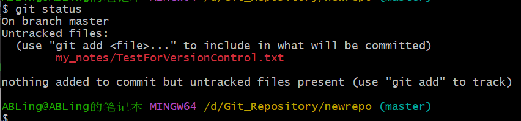
4. 输入`git add .`将新文件存入暂存区
5. 生成版本控制`git commit -m 'V2'`
- 总结版本控制指令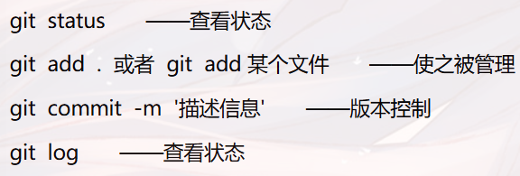
> 发现一个问题,从vsc复制到git bash时会变为`^[[200~ 内容 ~ `的格式
>>经查阅资料,这是由于git bash默认开启Bracketed paste mode，这是一种允许终端仿真器告知编程环境正在输入的文本是以粘贴的方式输入的.  
因此我使用了`echo -e "\e[?2004l"`关闭Bracketed paste mode
##  5. 将该本地仓库关联到GitHub的自己账号下的远程仓库
>本地Git仓库和GitHub仓库之间的传输是通过SSH加密传输的，所以需要配置ssh key(来自https://blog.csdn.net/qq_29493173/article/details/113094143)
1. 创建SSH Key  
使用`ssh-keygen -t rsa -C "2024090912018@std.uestc.edu.cn"`[^1]
[^1]:注册github使用的是此邮箱
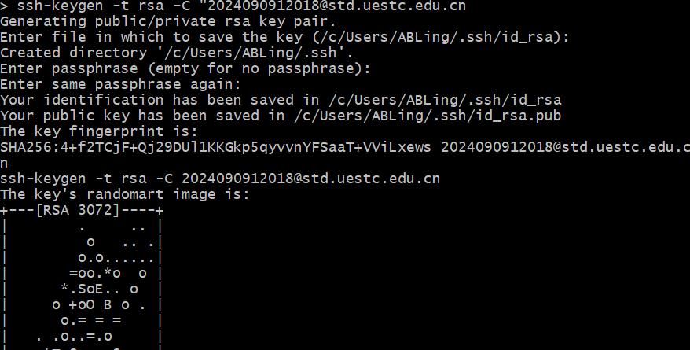
> SSH Key的秘钥对：id_rsa是私钥，不能泄露；id_rsa.pub是公钥，可以公开
2.  github填写SSH Key
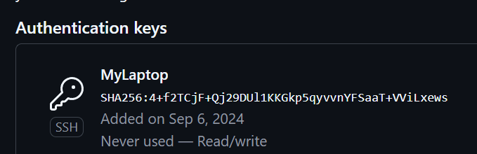
3. 验证  输入`ssh -T git@github.com`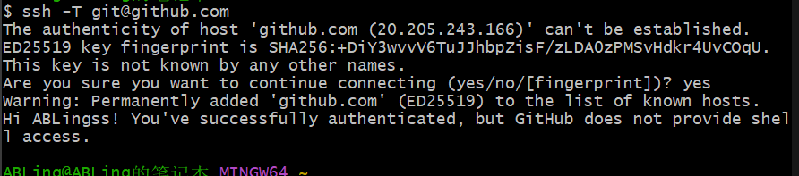
4. github建仓库 
      
5. 关联远程仓库  `git remote add origin https://github.com/ABLingss/Elegant.git`
6. 本地内容上传推送  `git push -u origin master`[^2]
[^2]:由于新建的远程仓库是空的，所以要加上-u这个参数,之后仓库不是空的，就不用加上-u `git push origin master`
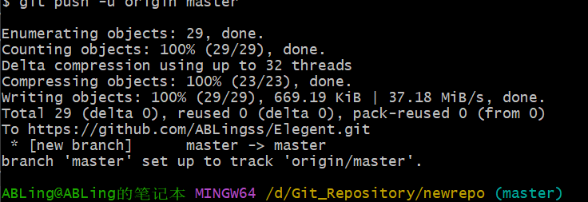
##  6. 我想说的
- 之所以写这么详细,是因为我想通过记录我做的每个步骤方便我后续回看,同时更熟练的掌握git指令.在之后的笔记中,我可能只会重点记录所使用的代码和完成的结果,希望未来看到这篇笔记,我还能想起军训期间学习这份招新题时的心情
- 附上git基本操作方便查阅
##  7. git基本操作
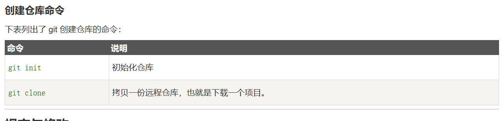  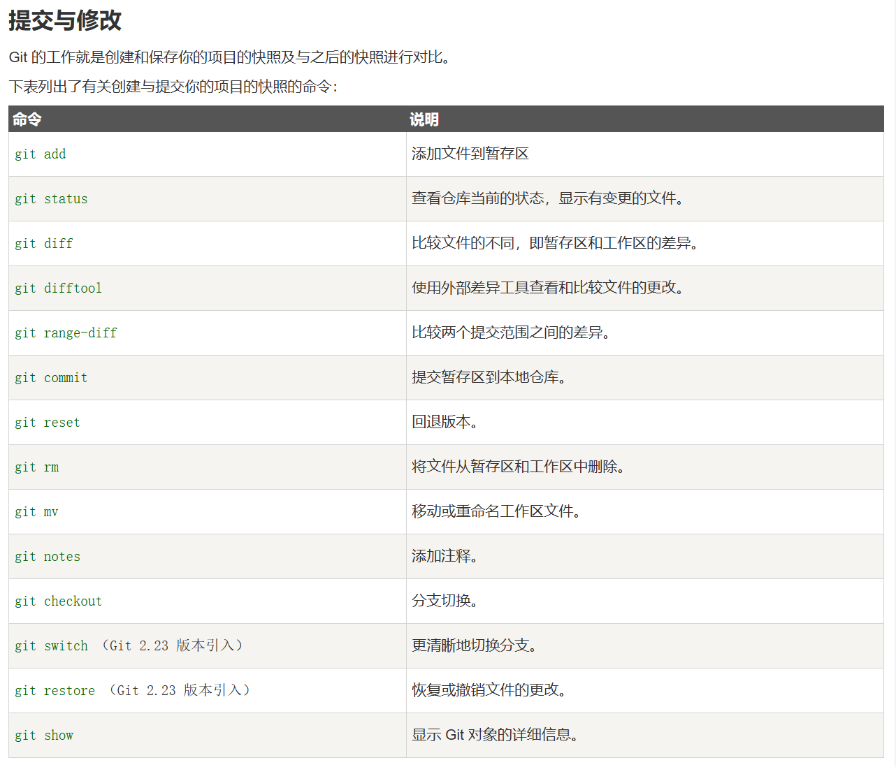  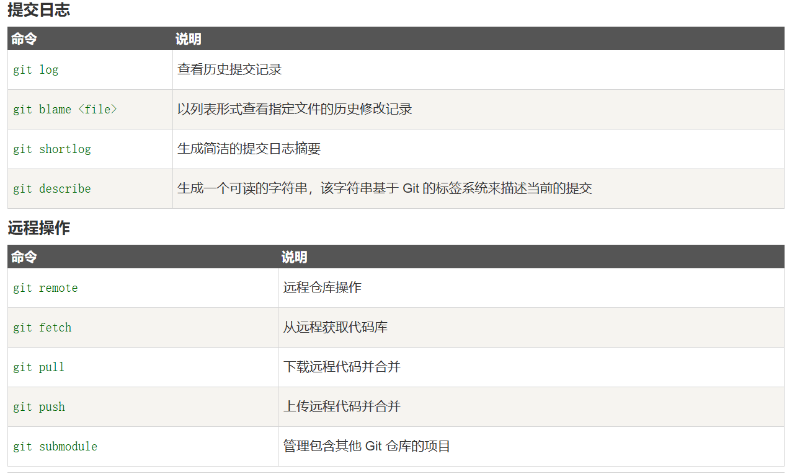 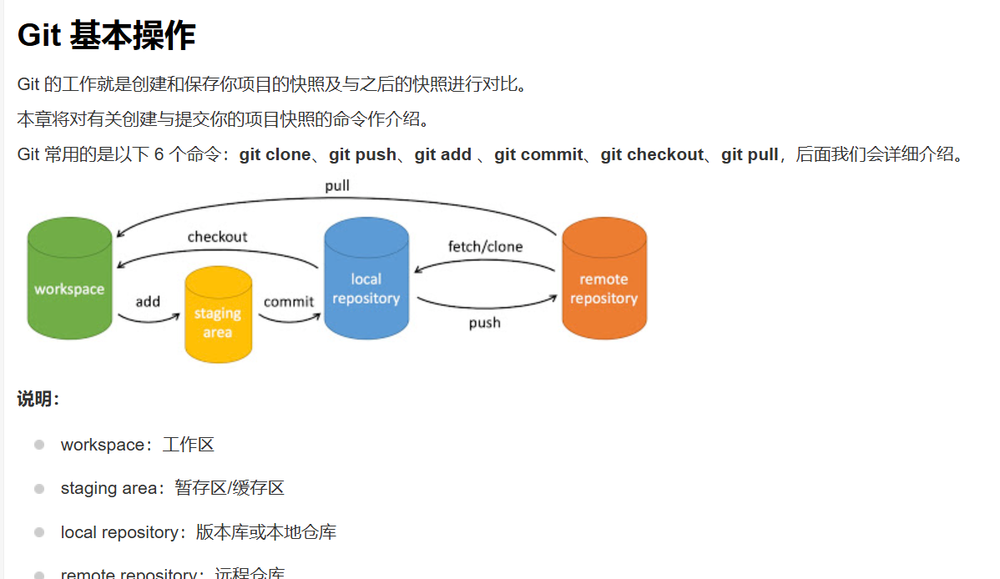
------
##  8. 完成任务要求
- 我的远程仓库Elegant  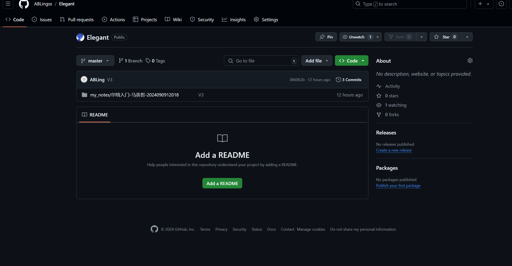
- 远程仓库链接https://github.com/ABLingss/Elegant