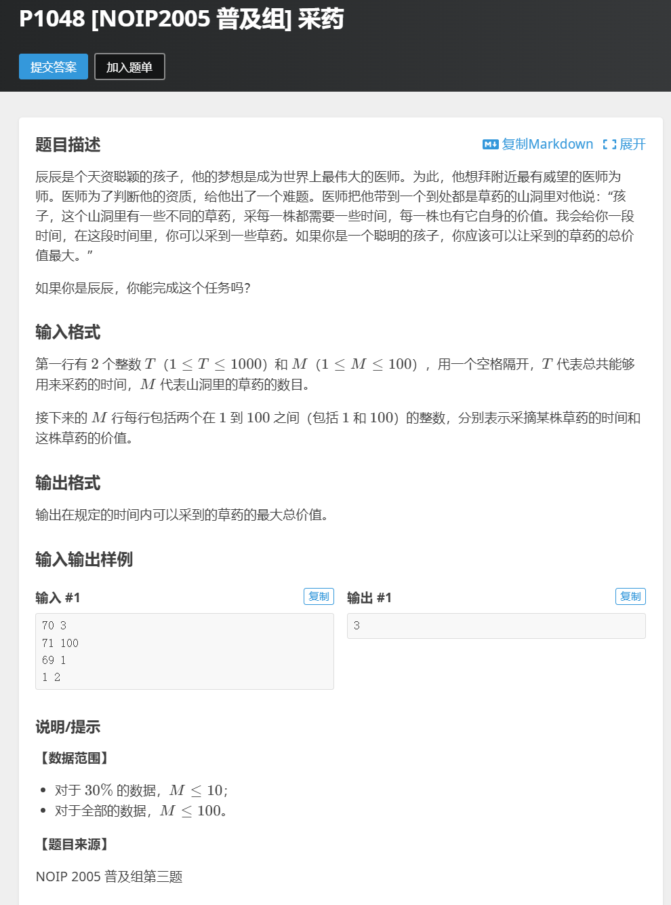

# C语言基础
## CS50学习
我正在学习CS50,截止到军训完*9月13日*,我已经学习到Lecture 4,我会在开学后的前几天完成cs50剩余部分的学习.

因为尔绮在军训后将发布正式的招新,我想讲这一阶段的学习成果先总结为这整个入门文档发给您,之后我会再完成正是招新提的同时继续进行入门指南要求的任务.

这是我的cs50仓库,您可以看到我实时提交的作业进度[cs50](https://github.com/ABLingss/CS50)

## 根据尔绮工作室的招新要求,我完成了三道洛谷`普及-`以上的题目

这是我的[洛谷](https://www.luogu.com.cn/user/1382446)

这是三道题目以及我的source code
1. 
```
def max_value(T, M, herbs):
    # 初始化dp数组
    dp = [[0 for _ in range(T + 1)] for _ in range(M + 1)]
    
    # 遍历每一种草药
    for i in range(1, M + 1):
        time, value = herbs[i - 1]
        # 遍历所有可能的时间
        for j in range(T + 1):
            # 如果当前草药的采摘时间小于等于当前时间
            if time <= j:
                # 选择采摘或不采摘的最大价值
                dp[i][j] = max(dp[i-1][j], dp[i-1][j-time] + value)
            else:
                # 否则只能选择不采摘
                dp[i][j] = dp[i-1][j]
    
    # 返回最大价值
    return dp[M][T]

# 读取输入
T, M = map(int, input().split())
herbs = [tuple(map(int, input().split())) for _ in range(M)]
```
> 用python写主要是因为我对c还是不太熟练

2. 