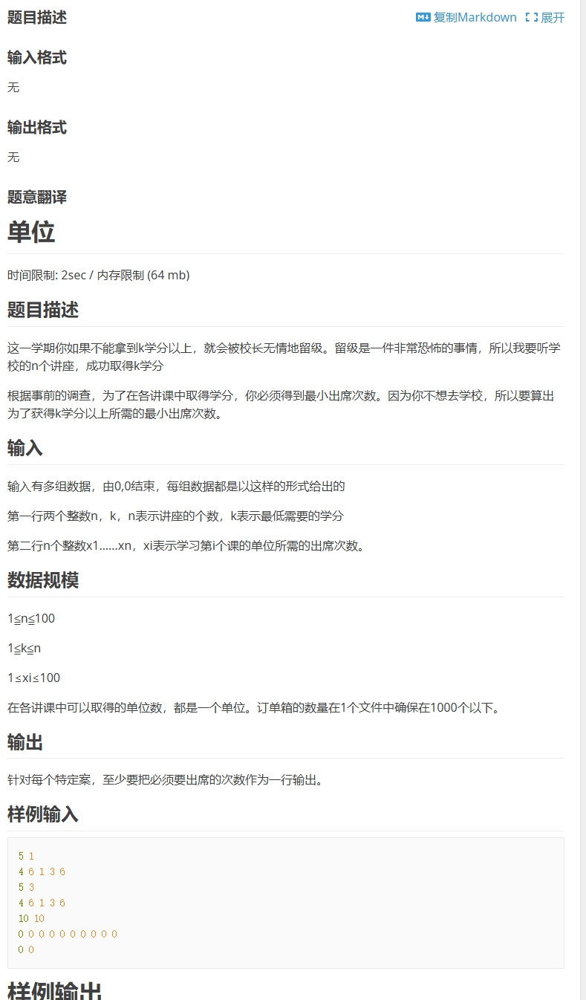
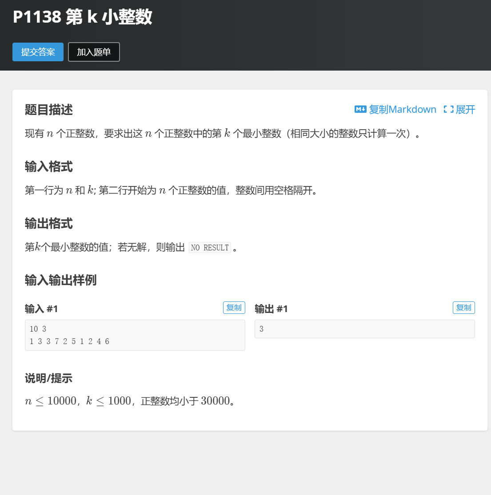

# C语言基础
## CS50学习
我正在学习CS50,截止到军训完*9月14日*,我已经学习到Lecture 4,我会在开学后的前几天完成cs50剩余部分的学习.

因为尔绮在军训后将发布正式的招新,我想讲这一阶段的学习成果先总结为这整个入门文档发给您,之后我会再完成正是招新提的同时继续进行入门指南要求的任务.

这是我的cs50仓库,您可以看到我实时提交的作业进度[cs50](https://github.com/ABLingss/CS50)

## 根据尔绮工作室的招新要求,我完成了三道洛谷`普及-`以上的题目

这是我的[洛谷](https://www.luogu.com.cn/user/1382446)

这是三道题目以及我的source code
1.  https://www.luogu.com.cn/problem/P1048
```
def max_value(T, M, herbs):
    # 初始化dp数组
    dp = [[0 for _ in range(T + 1)] for _ in range(M + 1)]
    
    # 遍历每一种草药
    for i in range(1, M + 1):
        time, value = herbs[i - 1]
        # 遍历所有可能的时间
        for j in range(T + 1):
            # 如果当前草药的采摘时间小于等于当前时间
            if time <= j:
                # 选择采摘或不采摘的最大价值
                dp[i][j] = max(dp[i-1][j], dp[i-1][j-time] + value)
            else:
                # 否则只能选择不采摘
                dp[i][j] = dp[i-1][j]
    
    # 返回最大价值
    return dp[M][T]

# 读取输入
T, M = map(int, input().split())
herbs = [tuple(map(int, input().split())) for _ in range(M)]
```
> 用python写主要是因为我对c还是不太熟练

2.  https://www.luogu.com.cn/problem/AT_fuka_credit
```
#include <stdio.h>
#include <stdlib.h>

int min_attendance(int n,int k,int *lectures);
// 比较函数
int compare(const void *a, const void *b)
{
    return (*(int*)a - *(int*)b);
}

int main(void)
{
    int n, k;
    // 读取输入,loop直到遇到0, 0
    while (scanf("%d %d", &n, &k) && (n != 0 || k != 0))
    {
        int *lectures = (int*)malloc(n * sizeof(int));// 返还一个变量或类型在内存中所占的字节数

        for (int i = 0; i < n; i++)
        {
            scanf("%d", &lectures[i]);
        }

        int result = min_attendance(n, k, lectures);
        printf("%d\n", result);
    }

    return 0;
}

// 对讲座次数进行排序, 寻找最少上课次数
int min_attendance(int n,int k,int *lectures)
{
    qsort(lectures, n, sizeof(int), compare);

    int attendance = 0;
    int credits = 0;  // 已获得的学分

    // 遍历讲座，直到获得足够的学分
    for (int i = 0; i < n && credits < k; i++)
    {
        attendance += lectures[i];
        credits++;
    }

    return attendance;
}
```
> 我挑选这道题纯粹是因为cs50讲到了指针,同时我浏览器打开了stdlib在cs50上的手册说明,所以想尝试把L3的排序与L4的指针结合一下. 本题主要耗时在查阅各种函数的使用方法上了,感谢伟大的GPT直接告诉我用法!
> 然后我发现这种类型的题叫做贪心算法, 但是这种类型的题貌似还是有点难,等我对语言的掌握更深入后会再找几道做做

3.  https://www.luogu.com.cn/problem/P1138
```
def find_kth_smallest(n, k, numbers):
    # 将列表中的整数排序
    sorted_numbers = sorted(set(numbers))  
    # 使用 set 去重!!!，然后排序
    if k > len(sorted_numbers):
        return "NO RESULT"
    else:
        return sorted_numbers[k-1]  

# 读取输入
n, k = map(int, input().split())
numbers = list(map(int, input().split()))

print(find_kth_smallest(n, k, numbers))
```
> 用python是因为有sort,不想写循环,想实现一个极限的少代码量.
> 用c写的话,我有一点不会写去重的函数, 这应是我之后重点学习的内容,此题的延申就先到此为止罢
> 另外c++有set库也能实现这一点
