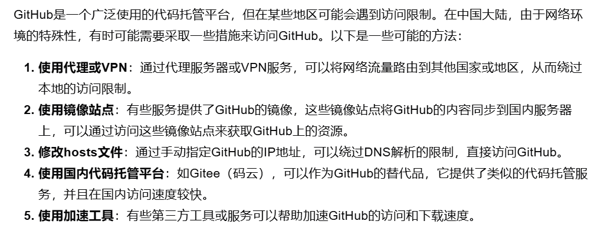
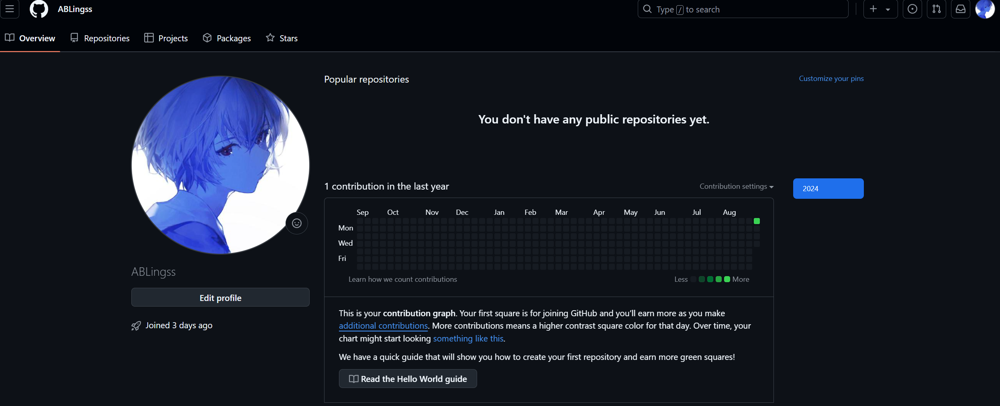

# 学会提问
*我没能打开上述文章*

## 分析问题
  - 通过搜索,我得知Github在国内可能是由于网络审查制度，旨在控制或过滤访问某些境外网站的内容被限制访问.这种限制通常通过DNS污染、IP地址封锁或者流量过滤等方式,这与我了解的steam主页发生-118错误的形式类似:有时可进入,有时被屏蔽.
## 解决问题
   **通过询问AI,我得到了此问题的几种解决方式,进行了一一尝试**
   
 - 使用VPN: 我使用阿里加速器加速香港节点,成功进入了Github网站并注册账号.
 - 使用镜像站:写下此笔记时, https://toolwa.com/github/ 可进入并下载特定Github仓库
 - 修改hosts:
    1.  我打开了位于 C:\Windows\System32\drivers\etc\hosts的文件 
    2.  我在末尾添加了140.82.114.4 github.com 即github的IP地址
    3.  我打开cmd并执行ipconfig /flushdns
    4.  成功打开了github
-  使用Gitee:我注册了Gitee账号并同步了我的Github仓库
-  使用加速工具:Watt Toolkit[^1]可加速github
[^1]:原steam++  
[^2]:常见问题文件
## 概括文章内容
- 提问前
    - 像赢家那样提问 —— 聪明、自信、有解决问题的思路
    - 提问前先做足功课,例如思考可能得到的回复
    - 先自行尝试解决问题,搜索旧文章、上网搜索、阅读手册和FAQ[^2],询问朋友,阅读源码
    - 提出问题的时候，表明已经做了努力
- 提问时 
    - 慎选提问的论坛,确保问题与论坛主题相关
    - 向列表而不是其中的个别成员提问
    - 简洁描述问题
    - 描述目标而不是过程,明确你的需求
    - 展现你已尝试解决问题。
    - 说明里应该包含你的操作步骤，以及机器和软件的反应
    - 不要在标题写紧急：避免引起反感
    - 公开透明具体地提问
    - 礼貌地提问,并在问题解决后，加个简短的补充说明,告知问题已解决
- 解读答案
    - 如果被告知去读手册或搜索网络,意味着信息容易获得
    - 尝试自己弄懂,追问时表明自我的努力
    - 保持冷静，不要无礼
    - 不怕批评,别抬杠
- 其他
    - 通过询问商业公司,询问本地群组等方式得到更多答案
## Github账号

## 对Github的理解
 - 过去常用GitHub下载一些软件,然而注册账号是在最近的事情.这个网站有庞大的开发者社群,在我学习软件工程的道路上,可以很方便的参与技术讨论以及下载软件及代码.
 - Github的开源文化以及许多的开源项目对我学习软工应当很有帮助
 - Github的公有和私有仓库能让我的代码在云端存储
 - Github有许多我目前还用不到的集成工具,在做项目时应当十分高效
