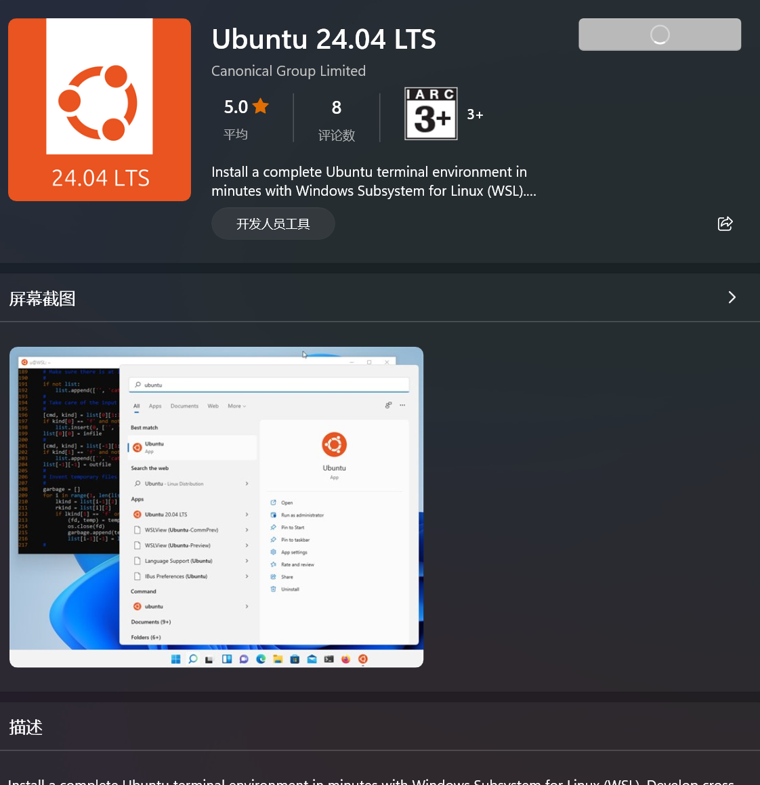
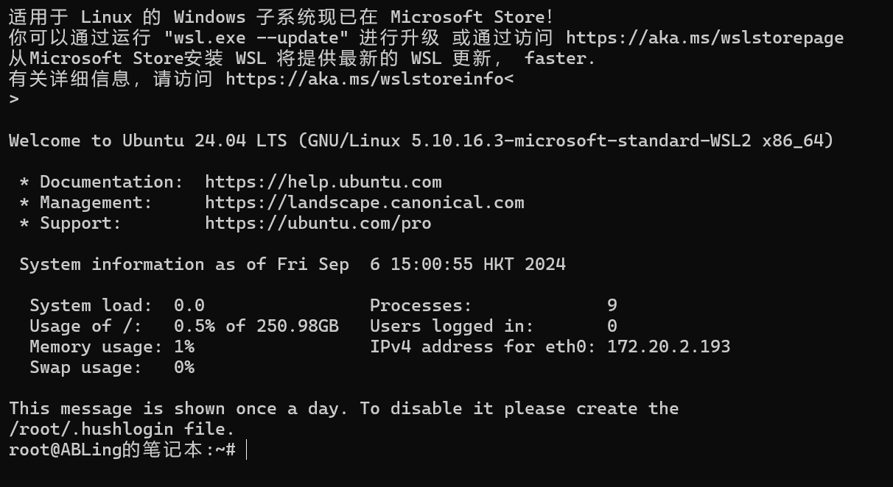
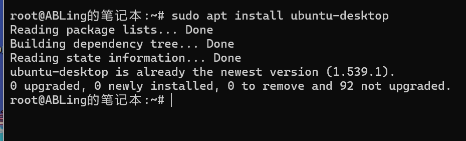
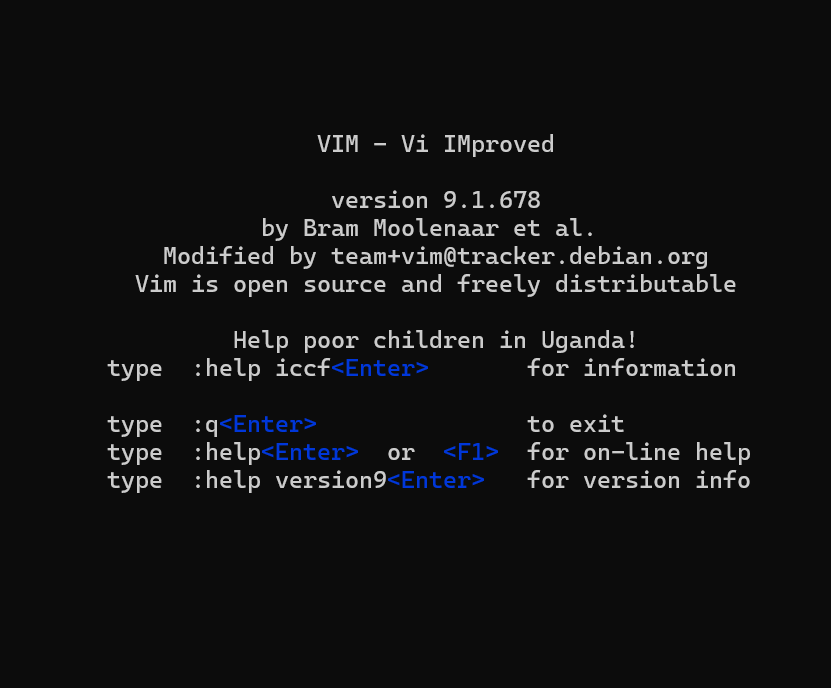

<!-- vscode-markdown-toc -->
* 1. [什么是Linux](#Linux)
* 2. [Linux能解决什么Windows解决不了的问题](#LinuxWindows)
* 3. [配置Linux](#Linux-1)
	* 3.1. [什么是WSL2](#WSL2)
	* 3.2. [安装过程](#)
* 4. [Linux基本操作](#Linux-1)
	* 4.1. [首先,我要搞一个桌面系统](#-1)
	* 4.2. [我要学习一些Linux命令行方式的操作](#Linux-1)

<!-- vscode-markdown-toc-config
	numbering=true
	autoSave=true
	/vscode-markdown-toc-config -->
<!-- /vscode-markdown-toc --># Linux
##  1. <a name='Linux'></a>什么是Linux
>Linux 是一个开源的类 Unix [^1]操作系统内核，由 Linus Torvalds 在1991年首次发布。它遵循自由软件和开源开发的原则，任何人都可以自由地使用、修改和分发 Linux 内核。Linux 内核是操作系统的核心部分，负责管理系统资源、处理硬件设备请求、管理文件系统和控制程序执行等。

>Linux 系统通常指的是以 Linux 内核为基础，搭配各种用户空间程序和库文件，以及图形界面和其他工具的完整操作系统。这些系统通常被称为 Linux 发行版，因为它们是由不同的组织或社区发行的，每个发行版都有其特定的目标用户和用途。
##  2. <a name='LinuxWindows'></a>Linux能解决什么Windows解决不了的问题
1. 嵌入式系统   
Linux比win更轻量,适合用于智能家居,车机等系统中
2. 老旧硬件上  
win可能已经很难在一些古早或低性能设备上运行,linux则可以
3. 免费和开源  
当我想在工业领域使用win,版权支出将是一笔很大的投入.免费开源的Linux可以方便中小型企业进行开发
4. 多用户多任务   
Linux 支持多用户同时使用系统，并且能够同时运行多个任务。
5. 跨平台使用  
例如Android就是使用Linux内核研发的,用Linux帮助开发者减少了跨平台移植的重复工作.
[^1]:Unix 是一个广泛使用的、多用户、多任务的操作系统，最初由肯·汤普逊（Ken Thompson）、丹尼斯·里奇（Dennis Ritchie）和他们的团队在 1969 年于美国贝尔实验室开发。Unix 系统以其稳定性、安全性、灵活性和强大的文本处理能力而闻名.
-----
-----
-----
##  3. <a name='Linux-1'></a>配置Linux
***接下来,我将通过WSL2运行Linux的发行版Ubuntu***
###  3.1. <a name='WSL2'></a>什么是WSL2 
>WSL（Windows Subsystem for Linux）是微软推出的一种在 Windows 操作系统上运行 Linux 的解决方案。WSL2 是 WSL 的第二个版本，通过虚拟化技术使 Linux 内核直接运行在轻量级虚拟机中，从而提高了性能和兼容性。  
###  3.2. <a name=''></a>安装过程
我参考了这篇文章[CSDN博客](https://blog.csdn.net/Huahua_1223/article/details/140478455)
1. 
2. Powershell命令`dism.exe /online /enable-feature /featurename:Microsoft-Windows-Subsystem-Linux /all /norestart`启用WSL
3. PowerShell启用虚拟机平台`dism.exe /online /enable-feature /featurename:VirtualMachinePlatform /all /norestart`
4. 重启后自动安装WSL2,在VSC上安装了wsl扩展
5. 将WSL2设置为默认版本`wsl --set-default-version 2`
6. 安装Ubuntu24.04
7. 报错
```
WslRegisterDistribution failed with error: 0x800701bc
Error: 0x800701bc WSL 2 ?????????????????? https://aka.ms/wsl2kernel
```  
检索网络信息,普遍认为是未下载WSL2 Linux 内核更新包,在[下载地址](https://wslstorestorage.blob.core.windows.net/wslblob/wsl_update_x64.msi)下载了此更新包
8. 成功install了ubuntu,注册了Unix账号(我没有设定密码,我的名称为`abling`)
> 记录一下Linux用户名称规则 
> 规则一：Linux用户名只允许使用小写字母、数字和下划线，不接受其它特殊字符，比如星号，百分号，全角符号等。  
规则二：Linux用户名通常最多可以包含32个字符，长度过长将不被系统允许。  
规则三：一般以字母开头，尽量避免使用数字开头，因为有时候与IP地址混淆容易产生混乱。  
规则四：Linux用户名的首字母必须是小写，不能使用大写开头，否则系统无法正常识别。  
规则五：如果要删除已经创建的Linux用户名，必须使用rm –f命令，不可用rm –rf命令，不然容易破坏文件系统。
9. 完成了安装   

------
------
------
##  4. <a name='Linux-1'></a>Linux基本操作
###  4.1. <a name='-1'></a>首先,我要搞一个桌面系统
1. 执行`apt-get update`
2. 执行`apt install gnome-panel gnome-settings-daemon metacity nautilus gnome-terminal ubuntu-desktop`[^2]
[^2]:在Ubuntu 系统中安装 GNOME 桌面环境的一组软件包
3. 这个时候我意识到其实不需要通过远程桌面进入,我可以直接下载桌面系统并注销后切换,因此我使用了`sudo apt install ubuntu-desktop`下载GNOME(默认的)桌面系统  
输出结果
4. 我发现我并不能切换,经过搜索,我了解到WSL2 主要是为命令行界面（CLI）和服务器应用程序设计的，它并不直接支持图形用户界面（GUI）应用程序,这并不是双系统.
5. 因此我试着安装一些linux软件`sudo apt install <package_name>`
6. 我下载了vim
7. 我发现使用GWSL可以安装、配置和运行 Linux GUI 应用程序。  
>  但是它57块钱!,有点贵
8. 因此我暂时放弃了用wsl打开ubuntu的gui的想法,但我保留一个AI结果以供给后来参考
```
在Windows Subsystem for Linux (WSL) 中运行Ubuntu GUI应用程序，你可以按照以下步骤操作：

1. **安装WSL**：首先确保你已经在Windows上安装了WSL。如果没有，可以通过Windows功能开启它。

2. **安装Ubuntu**：在Microsoft Store中搜索Ubuntu，然后安装它。

3. **安装X Server**：为了在Windows上显示Linux GUI，你需要一个X Server。常用的X Server有VcXsrv、Xming等。安装其中一个。

4. **配置X Server**：安装X Server后，你可能需要配置它以允许通过WSL连接。这通常涉及到设置DISPLAY环境变量。

5. **安装GUI应用程序**：在Ubuntu中，使用`apt`安装你想要运行的GUI应用程序。

6. **运行GUI应用程序**：在Ubuntu终端中，启动你的GUI应用程序。如果一切设置正确，它应该能够在Windows中显示。

以下是更详细的步骤：

### 安装WSL和Ubuntu

1. 打开PowerShell以管理员身份。
2. 运行以下命令来启用WSL功能：
   ```powershell
   wsl --install
   ```
3. 从Microsoft Store安装Ubuntu。

### 安装X Server

1. 下载并安装X Server，例如VcXsrv。
2. 启动X Server，并记下它提供的DISPLAY变量值。

### 配置DISPLAY环境变量

1. 在Ubuntu中，设置DISPLAY环境变量。你可以将以下命令添加到`~/.bashrc`或`~/.profile`文件中，以便每次启动时自动设置：
   ```bash
   export DISPLAY=$(cat /etc/resolv.conf | grep nameserver | awk '{print $2}'):0
   ```
   这行命令将DISPLAY设置为X Server的IP地址和端口。

### 安装GUI应用程序

1. 在Ubuntu终端中，使用`apt`安装GUI应用程序，例如：
   ```bash
   sudo apt update
   sudo apt install gnome-terminal
   ```

### 运行GUI应用程序

1. 在Ubuntu终端中，运行你的GUI应用程序，例如：
   ```bash
   gnome-terminal
   ```

如果遇到问题，确保X Server正在运行，并且DISPLAY环境变量正确设置。此外，某些应用程序可能需要额外的配置或依赖项。
```
9.从此文档中完成在vsc上使用linux开发https://code.visualstudio.com/docs/remote/wsl-tutorial


###  4.2. <a name='Linux-1'></a>我要学习一些Linux命令行方式的操作
[Linux 常用操作命令大全](https://blog.csdn.net/m0_46422300/article/details/104645072)
> 说实话,现阶段我的学习中linux的必要性并不大,我决定先保留此文档,在日后开发中需要GUI或回顾基本操作时使用


